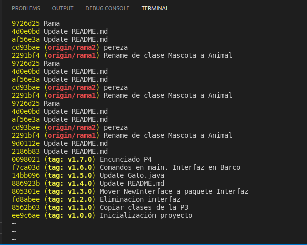
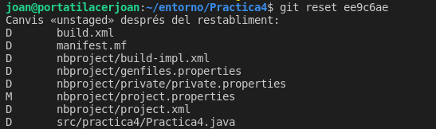
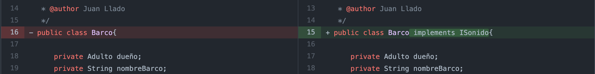
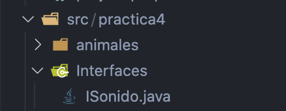
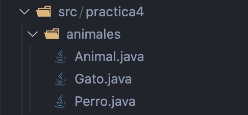
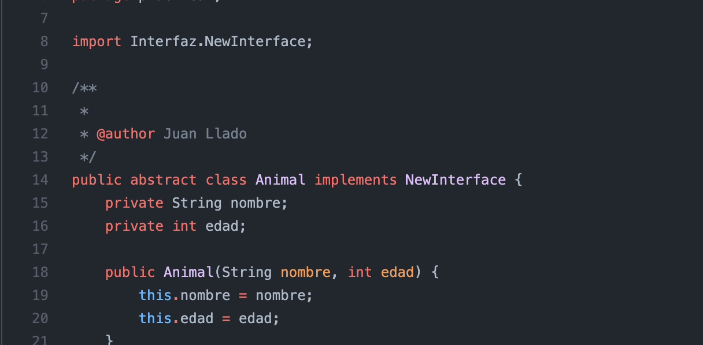
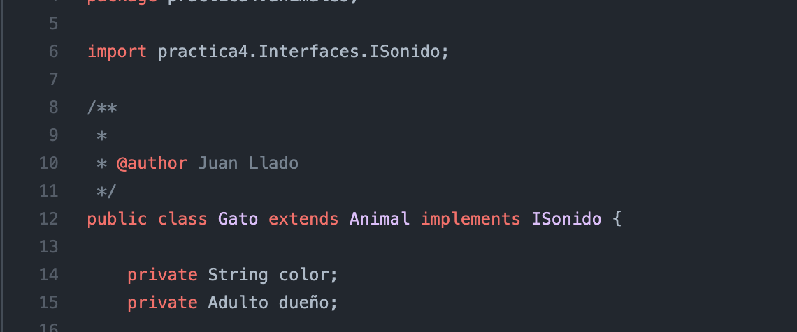
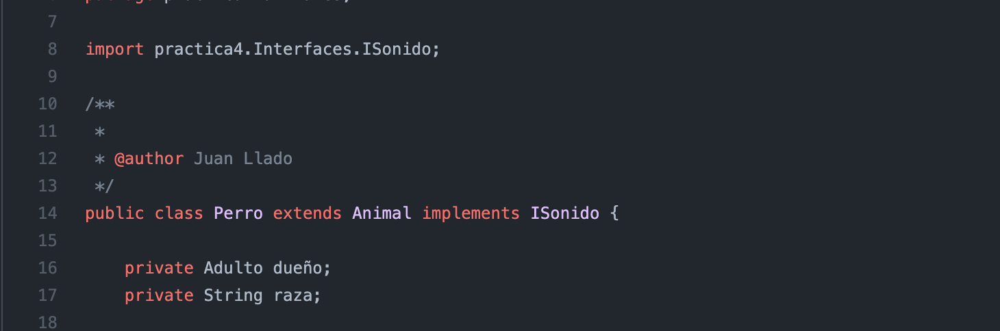

# Entornos de desarrollo
---
## práctica - VERSIONES DE GIT HUB

### Pasos:

1. Hacer un git clone 

	```
    git clone https://github.com/JuanLlado/Practica4.git
    ```


2. Mirar el historial de commits donde muestra todos los commits por líneas, el identificador y el tag

    Comando: 
    ```
    git log --oneline
    ```


3. Volver a una versión anterior. En este caso tendremos que volver a la versión del tag 1.0.0
   
    Comando:
    ```
    git reset identificadorIDCommit
    ```

4. Mirar el historial de commits para confirmar que estemos en la versión que queremos.

    Comando:
    ```
    git log –online
    ```
para ello hacemos un git log para ver el id que buscamos:
    

ahora que disponemos del id podemos hacer el reset:




### Realizar 2 refactorizaciones. 

**Borar la iterfaz `newInterface` y que ya no sea implementada por barco.**

1. Crear una interfaz llamada ISonido dentro de la carpeta `src/practica4`.
2. Entrar en la clase Barco y en la linea dónde inicializa la clase (*public class 
Barco{...*) tendremos que implementar `ISonido`. Por lo que quedaría así:

    

3. Subir a la rama develop con el comando `git push`. IMPORTANTE! En el caso de trabajar en equipo
es importante hacer un `git pull` antes de hacer un `git push`, es decir, 
primero hay que actualizar los cambios hechos antes de subirlos al GitHub. 

**Crear un paquete nuevo y añadir la interfaz dentro** 
1. Crear un package dentro de `src/practica4` llamado `Interfaces`. 
2. Meter la interfaz `ISonido` en el package `Interfaces`.

    

3. Subir a la rama develop con el comando `git push`. IMPORTANTE! En el caso de trabajar en equipo
   es importante hacer un `git pull` antes del de hacer un `git push`, es decir,
   primero hay que actualizar los cambios hechos antes de subirlos al GitHub.
4. Actualizar la rama master con la nueva versión estable.

    Crear una nueva versión:
    ```
    git tag -a v2.0.0 -m "mover la interfaz a un paquete dedicado a interfaces" ec67c2f
    ```

### Realizar 2 refactorizaciones más en la rama de desarrollo desde la versión anterior.
1. Pasar a la rama develop para refactorizar. 
2. Crear un package llamado Animales y metemos todas las clases relacionadas con los animales. 
Esta refactorización quedaría como `src/practica4/animales` y allí añadiremos `Animal.java` , 
`Gato.java` , `Perro.java`.
   
3. Implemtar la interfaz `ISonido` a la clase animal, gato, perro. Por lo que tendremos 
que entrar en cada uno de ellos y donde inicializa la clase añadir al lado `implements ISonido`
como se ve en las imagenes siguientes.
   
###### _Implemtar la interfaz ISonido a la clase animal_
   
###### _Implemtar la interfaz ISonido a la clase gato_
   
###### _Implemtar la interfaz ISonido a la clase perro_
además de sobreescribir el método para que cada animal tenga una implementación distinta
4. Subir a la rama develop con el comando `git push`. IMPORTANTE! En el caso de trabajar en equipo
      es importante hacer un `git pull` antes del de hacer un `git push`, es decir,
      primero hay que actualizar los cambios hechos antes de subirlos al GitHub.
5. Actualizar la rama master con la nueva versión estable.
  
  Crear una nueva versión:

    ```
    git tag -a v3.0.0 -m "Segunda refactorización" 870fda3
    ```
